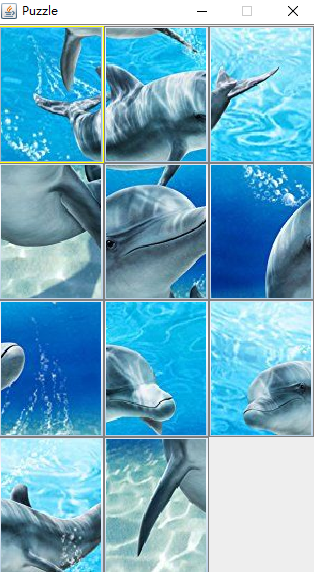
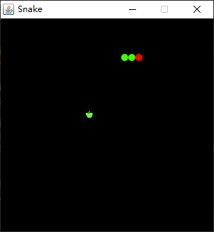
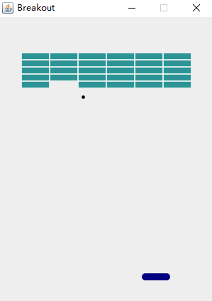
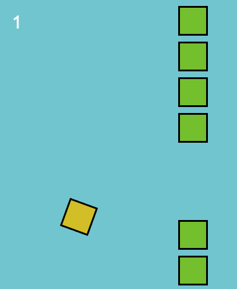

# Game

Game

## [Puzzle Game](PuzzleGame)

Tutorial: http://zetcode.com/tutorials/javagamestutorial/puzzle/

## [Snake](Snake)

Tutorial: http://zetcode.com/tutorials/javagamestutorial/snake/

## [Breakout](Breakout)

Tutorial: http://zetcode.com/tutorials/javagamestutorial/breakout/

## [FlappyBird](FlappyBird)

Tutorial 1: http://www.lessmilk.com/tutorial/flappy-bird-phaser-1
Tutorial 2: http://www.lessmilk.com/tutorial/flappy-bird-phaser-2

## 补充

项目持续更新，欢迎您[Star本项目](https://github.com/AndyFree96/Game)

## License

[The MIT License](LICENSE)